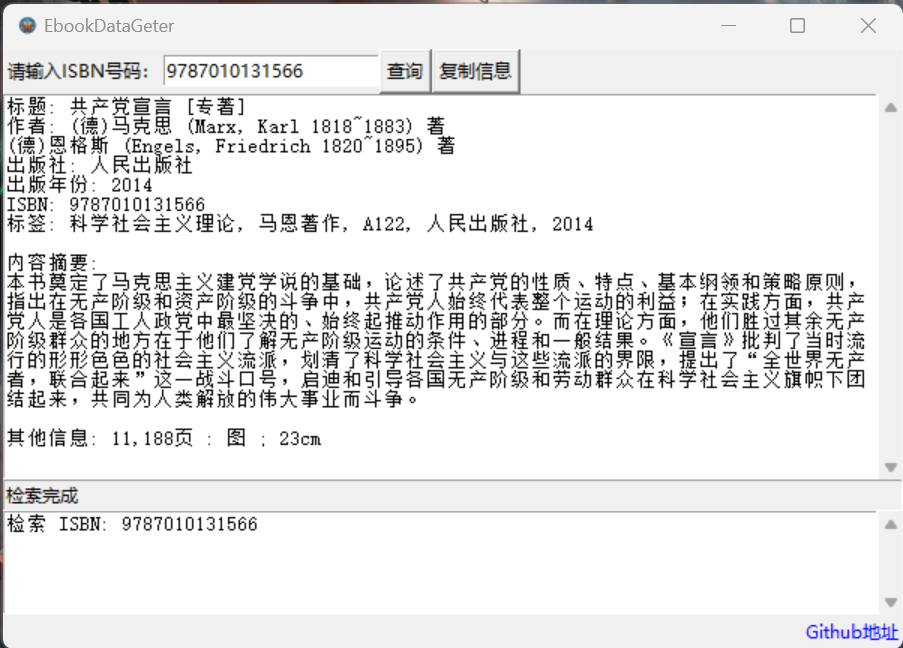

# EbookDataGeter

EbookDataGeter 是一个基于 [NLCISBNPlugin](https://github.com/DoiiarX/NLCISBNPlugin) 的改进项目，提供了一个简单易用的图书数据获取工具。此项目使用 tkinter 库构建了一个直观的图形用户界面（GUI），使用户能够轻松地检索和处理图书信息。

在此向`NLCISBNPlugin`的开发者表达感谢！

## 主要特点

- **图书信息检索**：通过输入 ISBN 号，快速获取图书的详细信息。
- **信息展示**：在 GUI 中清晰展示检索到的图书信息。
- **剪贴板支持**：方便地复制检索结果到剪贴板，以便于进一步使用。

## 使用说明

1. 克隆仓库到本地：`git clone https://github.com/Hellohistory/EbookDataGeter.git`
2. 安装所需依赖
3. 运行程序：`python main.py`

## 运行截图

## 贡献

如果你有任何改进建议或功能请求，欢迎通过 GitHub 的 Issues 或 Pull Requests 来贡献你的想法。

## 许可

本项目遵循 [Apache 2.0](LICENSE_1)与 [EbookData系列软件许可证](LICENSE_2) 许可协议。
